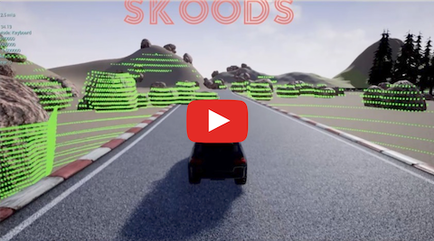
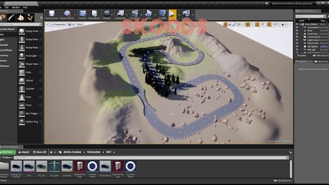

# Welcome to Skoods

Skoods is a Self-Racing Car Team, crowdsourced, running virtual competitions in our platform. We build simulation scenarios and models for self-driving cars as racing competitions.

Our community of pilots develops algorithms on our platform: learning, interacting and competing for the Podium.

Our mission is to have a real Self-Driving Car racing by 2020.

- Website: www.skoods.org

**Formula Skoods Intro**

[](https://youtu.be/_Ayh0lTGc_I)

**Video Teaser: Skoods inThe Goodwood Festival Of Speed 2018**

[](https://www.youtube.com/watch?v=X7a1ARVpse0)


## What's New

- November 20th, 2018 - Formula Skoods: Skoods Closed-way (Closed Circuit) Launch
- October 25th, 2018 - Alpha Version Race: track available to download


## Collaborate

### Slack Team

You can run the simulation and develop by your own. However, if you want to compete, join a racing team, collaborate and learn more about the technology, join our community:

[](https://join.slack.com/t/skoods/shared_invite/enQtNDg0MzEwNDY3MjgyLWVlNjRlYWRhNTFiNDk0OTBlYmY2ZDMzMGZhOThlZjQ5NDczNjI4MzgxMmQzZDEyZWZlMzViMWVhZDc2MDRmMzg)

### Open-Source Self-Racing Car

If you want to collaborate with the development of our Open-Source Self-Racing Car, also join our Trello board:

[](https://trello.com/b/U9xBONo2)


## Formula Skoods

Welcome to the first virtual racing competition for autonomous cars of the world: Formula Skoods!

Formula Skoods is a platform for engineers and developers where they create their own self-driving car algorithms and compete with other pilots around the world. Teams of 2 or more members can also compete.

Skoods provides a 3D simulation of the tracks as `.exe` files that pilots can run locally. We also provide an open-source self-racing car with the implementation of basic algorithms and technologies: it's a great way to start!

It doesn't matter if you are a begginer trying to learn the basics of autonomous vehicles or if you are a more advanced developer competing for the Podium. You can get started right away.

### Requirements

- Skoods competitions are currently supported to run on Windows 10 x64 and Python 3.6. Access the link [Getting Started to be guided to install the Skoods Python 3.6 environment with Anaconda](getting_started.md).

- We use Microsoft AirSim plugin to virtualize the sensors and call functions from the API.

You don't need to clone or download the AirSim project to your local machine to run our competitions, unless you wish to build the simulation by your own. However, getting to know the AirSim project is very important.

Know more about AirSim: [Welcome to AirSim](https://github.com/Microsoft/AirSim)

### Grand Prix

#### GP1: Skoods Closed-way (Closed Circuit)



It's a typical closed circuit track with a few challenges, like obstacles, shadows, different backgrounds and tight curves.

- Clockwise orientation
- 7 turns right, different angles
- 3 turns left, different angles
- Track with shadows from trees
- Obstacles on track
- Background changes from grass and green to sandy and beige
- 2D: no ascents and descents
- Number of race laps: 5

Download link:

- [Alpha Version Race - Quality High Windows x64](https://docs.zoho.com/file/akrkjad2edbb1f75442fcb42c4a1ba433ff4d)

- [Alpha Version Race - Quality Low Windows x64](https://docs.zoho.com/file/akrkj28babf6ff5234fbb9c1df1d018371ed8)

For this track, we will be using ground truth information from the simulation to get the localization of the car.

You can't use ground truth information of other cars. Here you will have to use Lidar and Camera to localize the other cars.

Phases:

- Qualify: 5 cars advance to the Finals

  [OPEN: Submit you code here!](https://forms.zohopublic.com/skoods/form/SkoodsClosedWayGP/formperma/Ge8mCDCVlXd_GJWn8cjdLhbb8tFRnFp_6AeYEekoA5g)

- Finals: 5 cars compete side by side

NOTE: The Season Score system will be communicated. Other circuits coming soon.

#### GP2: Skoods Egg-way (Oval Circuit)

*(Coming soon)* A typical oval track consists of two parallel straights, connected by two 180° turns. An egg-shaped oval corresponds to the classical form, however, the two straights are non-parallel arranged. A straight line is slightly longer than the other and the two curves have different radii.

- All turns to left
- Open angles
- High speed

- Counter-clockwise orientation
- Track width is the same all over the circuit
- 2D: no ascents and descents
- Number of laps: 5

Where there is generally one preferred line around a road course, there are many different lines which can work on an oval track.

### Race

Rules:

- Pilots can code cars on their own or join a team (not both).
- Teams are 2 or more Pilots that work together to submit a car.
- Pilots and Teams can submit different cars tunned for each track or one car for all tracks.
- If a car hits another car, it will be evaluated according these rules: [The Rules of Racing](https://f1metrics.wordpress.com/2014/08/28/the-rules-of-racing/). This is also a good way to define different behaviors for your car based on its state. (We are still woking on our own rules)

Instructions:

1. Go to [Getting Started](getting_started.md) to create and test your Python environment.
2. Download and open the track simulation file.
3. Clone this repo and navigate to the **SkoodsClosedWay/** folder. This folder contains the files needed to compete.
4. Run the `__main__.py` file:

```
activate skoods36
```

```
python __main__.py
```

4. Choose the option: **1** to record waypoints driving by your own, **2** to run the qualify and record the time of your first lap or **3** to race with 1 or more cars at the same time (you can use this feature to put your own cars to compete against each other).
5. You will also need to choose if you want to: **1** Pause simulation when processing (this option is good if your code will take a long time to process and you want the simulation to wait for it, avoiding delays) or **2** if you want to run it real-time.

## Code Structure

```
/Skoods/

  __main__.py
  
  /garage/
    /pid_car/
      __init__.py
      localization.py
      planning.py
      /control/
        __init__.py
        pid.py

  /skoods/
    __init__.py
    race.py
    utils.py
```

### Open-Source Self-Racing Car

`__main__.py`

`garage/pid_car/__init__.py`

`garage/pid_car/localization.py`

`garage/pid_car/planning.py`

`garage/pid_car/control/__init__.py`

`garage/pid_car/control/pid.py`

### Skoods Racing Support

`skoods/__init__.py`

`skoods/race.py`

`skoods/utils.py`

### Code Improvements

Here you can find information of what you can do to improve your car:

- Tune PID parameters: you can do it by hand or use Twiddle algorithms. [Twiddle - Artificial Intelligence for Robotics](https://www.youtube.com/watch?v=2uQ2BSzDvXs).
- Implement an MPC algorithm or other controllers.
- Use reinforcement learning or deep learning to mimic driver behavior.
- Implement search algorithms to find the optimal path, instead of following waypoints recorded.
- Develop perception and prediction algorithms to identify, localize and track other cars around.

