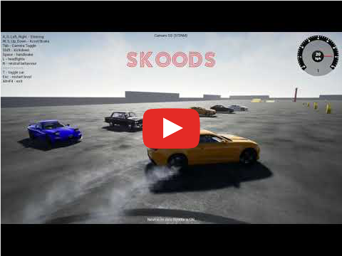
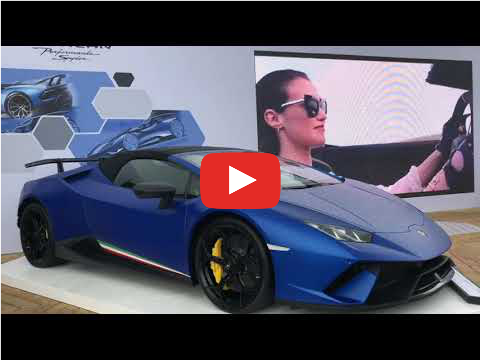
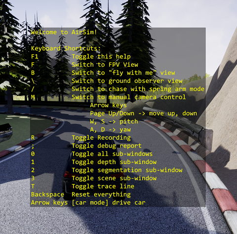

# Welcome to Skoods

Skoods is a Self-Racing Car Team, crowdsourced, running virtual competitions in our platform. We build simulation scenarios and models for self-driving cars as racing competitions.

Our community of pilots develops algorithms on our platform: learning, interacting and competing for the Podium.

Our mission is to have a real Self-Driving Car racing by 2020.

- Website: www.skoods.org

NOTE: You can run the simulation and develop by your own. However, if you want to compete, join a team of developers, collaborate and learn more about the technology, join our community: https://www.skoods.org/get-invited

*Skoods Moonshot Demo*

[](https://www.youtube.com/watch?v=8hI_HZZnYH0)

*Video Teaser: Skoods inThe Goodwood Festival Of Speed 2018*

[](https://www.youtube.com/watch?v=X7a1ARVpse0)

## What's New

- October 25th, 2018 - Alpha Version Race: Release

## Quick Start

Here you can learn the steps to quickly start coding your own self-racing car.

### Requirements

1. Skoods competitions are currently supported to run on Windows 10 x64 and Python 3.5. You will be guided to install Python 3.5 using Anaconda.

NOTE 1: If you are running Linux or iOS and would like to compete at Skoods, please [leave a message here describing your OS](https://github.com/skoods-org/welcome/issues/1).

NOTE 2: If you would like to also develop with C++, [please include your vote here](https://github.com/skoods-org/welcome/issues/2).

2. We use Microsoft AirSim plugin to virtualize the sensors and call functions from the API.

You don't need to clone or download the AirSim project to your local machine to run our competitions, unless you wish to build the simulation by your own. However, getting to know the AirSim project is very important.

Know more about AirSim: [Welcome to AirSim](https://github.com/Microsoft/AirSim)

### Download and Run the Competition Executable

1. Download the simulation with high or low graphics quality:

[Alpha Version Race - Quality High Windows x64](https://docs.zoho.com/file/akrkjad2edbb1f75442fcb42c4a1ba433ff4d)

[Alpha Version Race - Quality Low Windows x64](https://docs.zoho.com/file/akrkj28babf6ff5234fbb9c1df1d018371ed8)

2. Unzip the file.
3. Open the unzipped folder and double click the **AlphaVersionRace.exe** file to start the simulation.

NOTE 1: If it´s the first time you are running Skoods simulations, you will see the message: *"Would you like to use car simulation? Choose no to use quadrotor simulation."* Press **Yes** to continue.

4. In the simulation, Press `F1` to see the list of commands available.



NOTE 2: The simulation will create a folder called **AirSim/** in your **Documents/** folder. Inside it, you can find a new file called `settings.json`. You will learn more about this file later on. Also, if you activate the **Recording** mode by pressing `R`, new files will be added to this same folder.

5. Drive the car around. Press `0` and `;` to see data from virtual sensors.
6. Press `Alt + F4` to exit.

### Download and Install Anaconda

The open source Anaconda Distribution is the fastest and easiest way to do Python, data science and machine learning on Linux, Windows, and Mac OS X. It's the industry standard for developing, testing, and training on a single machine.

- Download and install the latest version: https://www.anaconda.com/download/

VIDEO TUTORIAL: [Python - Install Anaconda, Jupyter Notebook, Spyder on Windows 10](https://www.youtube.com/watch?v=Q0jGAZAdZqM)

### Create a Conda Environment

An environment consists of a certain Python version and some packages. Consequently, if you want to develop or use applications with different Python or package version requirements, you need to set up different environments.

We are currently developing and supporting Python version 3.5.

After installing Anaconda, Open the **Anaconda Prompt** app from the **Start Menu** and follow the instructions:

1. To create a new environment, type:

```comm
conda create -n skoods35 python=3.5
```

2. When conda asks you to proceed, type `y`:

```
proceed ([y]/n)?
```

3. After this process, check if the environment was created. To see a list of all of your environments, run::

```
conda info --envs
```

### Activate Environment

Every time you want to control the car using the API, you must first activate the skoods35 environment.

In your Anaconda Prompt, run:

```
activate skoods35
```

### Install Additional Packages

PIP is a package manager for Python packages, or modules if you like. A package contains all the files you need for a module and modules are Python code libraries you can include in your project.

First, upgrade PIP itself:

```
pip install --upgrade pip
```

Then, follow the instructions to install 3 additional packages. This may need you to run **Anaconda Prompt** as Administrator:

```
pip install msgpack-rpc-python
```

```
pip install airsim
```

```
conda install --channel https://conda.anaconda.org/menpo opencv3
```

If you use more Python packages in your code, you must install them here. Make sure the environment is activated before running the command.

### Run the Code

Before running the code, we must add a file that will define the initial setting of the simulation.

1. Clone or download this repo to your local machine: https://github.com/skoods-org/welcome

2. Create a new folder in the Documents folder called AirSim (if it´s not already there).

3. Copy and paste the `settings.json` file to the new folder:

```
/Documents/AirSim/settings.json
```

NOTE: Know more about the `settings.json` in the [Microsoft Airsim project page](https://github.com/Microsoft/AirSim/blob/master/docs/settings.md).

4. Open the Anaconda Prompt and activate the airsim35 environment:

```
activate skoods35
```

5. Double click the **AlphaVersionRace.exe** file to start the simulation (press `Alt+Tab` to go back to the Desktop).

6. Navigate to the **PythonExamples/** folder and run the `hello_skoods.py` file:

```
python hello_skoods.py
```

7. Press `Alt+F4` to exit.

### (Optional) Download and Install Visual Studio Code

**Visual Studio Code** combines the simplicity of a source code editor with powerful developer tooling.

I like to use **Visual Studio Code** to work on my projects. You can run Python code and change Conda Environments directly from the app.

- Download: https://code.visualstudio.com/download

MORE INFO:

- [Why VS Code?](https://code.visualstudio.com/docs/editor/whyvscode)
- [VS Code Python Tutorial](https://code.visualstudio.com/docs/python/python-tutorial)

## Coding You Own Self-Racing Car

Important links:

- [AirSim APIs](https://github.com/Microsoft/AirSim/blob/master/docs/apis.md)
- [AirSim Settings](https://github.com/Microsoft/AirSim/blob/master/docs/settings.md)
- [AirSim Python Examples](https://github.com/Microsoft/AirSim/tree/master/PythonClient/car)

More coming soon!!!

## Open-Source Self-Racing Car

Coming soon!!!