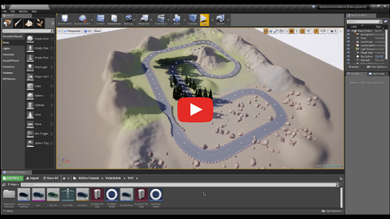

# Getting Started

An environment consists of a certain Python version and some packages. Consequently, if you want to develop or use applications with different Python or package version requirements, you need to set up different environments.

We are currently developing and supporting Python version 3.6.

### Download and Run the Simulation Executable

In the following video, you can see a general overview of the Alpha Version Race simulation and the visualization of the HD Map.

*Alpha Version Race*

[](https://youtu.be/oDBrac6QwOs)

1. Download the simulation track with high or low graphics quality:

[Alpha Version Race - Quality High Windows x64](https://docs.zoho.com/file/akrkjad2edbb1f75442fcb42c4a1ba433ff4d)

[Alpha Version Race - Quality Low Windows x64](https://docs.zoho.com/file/akrkj28babf6ff5234fbb9c1df1d018371ed8)

1. Unzip the file.
2. Open the unzipped folder and double click the **AlphaVersionRace.exe** file to start the simulation.

NOTE 1: If it´s the first time you are running Skoods simulations, you will see the message: *"Would you like to use car simulation? Choose no to use quadrotor simulation."* Press **Yes** to continue.

1. In the simulation, Press `F1` to see the list of commands available.


NOTE 2: The simulation will create a folder called **AirSim/** in your **Documents/** folder. Inside it, you can find a new file called `settings.json`. You will learn more about this file later on. Also, if you activate the **Recording** mode by pressing `R`, new files will be added to this same folder.

1. Drive the car around using the arrows. Press `0` and `;` to see data from virtual sensors.
2. Press `Alt + F4` to exit.

------

### Download and Install Anaconda

The open source Anaconda Distribution is the fastest and easiest way to do Python, data science and machine learning on Linux, Windows, and Mac OS X. It's the industry standard for developing, testing, and training on a single machine.

- Download and install the latest version: https://www.anaconda.com/download/

VIDEO TUTORIAL: [Python - Install Anaconda, Jupyter Notebook, Spyder on Windows 10](https://www.youtube.com/watch?v=Q0jGAZAdZqM)

### (Option 1) Create the environment from spec-file.txt

Navigate to the folder containing the `spec-file.txt` and run:

```
conda create --name skoods36 --file spec-file.txt
```

### (Option 2) Create a Conda Environment

After installing Anaconda, Open the **Anaconda Prompt** app from the **Start Menu** and follow the instructions:

1. To create a new environment, type:

```comm
conda create -n skoods36 python=3.6
```

2. When conda asks you to proceed, type `y`:

```
proceed ([y]/n)?
```

3. After this process, check if the environment was created. To see a list of all of your environments, run::

```
conda info --envs
```

Activate the Environment: Every time you want to control the car using the API, you must first activate the skoods36 environment.

4. In your Anaconda Prompt, run:

```
activate skoods36
```

Install Additional Packages: PIP is a package manager for Python packages, or modules if you like. A package contains all the files you need for a module and modules are Python code libraries you can include in your project.

5. First, upgrade PIP itself:

```
pip install --upgrade pip
```

6. Then, follow the instructions to install 3 additional packages. This may need you to run **Anaconda Prompt** as Administrator:

```
pip install msgpack-rpc-python
```

```
pip install airsim
```

```
pip install pynput
```

NOTE: If you use more Python packages in your code, make sure to install them with the environment activated.

------

### Run the Test Code

Before running the code, we must add a file that will define the initial settings of the simulation.

1. Clone or download this repo to your local machine.
2. Create a new folder in the Documents folder called AirSim (if it´s not already there, because the first time you run the simulation, it will be created).
3. Navigate to the **JSON_examples/** folder, copy and paste the `settings.json` file to the new folder:

```
/Documents/AirSim/settings.json
```

NOTE: If you run the simulation .exe, the file will be automatically created. Know more about the `settings.json` in the [Microsoft Airsim project page](https://github.com/Microsoft/AirSim/blob/master/docs/settings.md).

1. Open the Anaconda Prompt and activate the skoods36 environment:

```
activate skoods36
```

1. Double click the **AlphaVersionRace.exe** file to start the simulation (press `Alt+Tab` to go back to the Desktop).
2. Navigate to the **test/** folder and run the `hello_skoods.py` file:

```
python hello_skoods.py
```

NOTE: You will see the car moving around the track.

1. Press `Alt+F4` to exit.

### (Optional) Download and Install Visual Studio Code

**Visual Studio Code** combines the simplicity of a source code editor with powerful developer tooling.

I like to use **Visual Studio Code** to work on my projects. You can run Python code and change Conda Environments directly from the app.

- Download: https://code.visualstudio.com/download

MORE INFO:

- [Why VS Code?](https://code.visualstudio.com/docs/editor/whyvscode)
- [VS Code Python Tutorial](https://code.visualstudio.com/docs/python/python-tutorial)

### Important links

- [AirSim APIs](https://github.com/Microsoft/AirSim/blob/master/docs/apis.md)
- [AirSim Settings](https://github.com/Microsoft/AirSim/blob/master/docs/settings.md)
- [AirSim Python Examples](https://github.com/Microsoft/AirSim/tree/master/PythonClient/car)
- [AirSim Sensors](https://github.com/Microsoft/AirSim/blob/master/docs/sensors.md)

